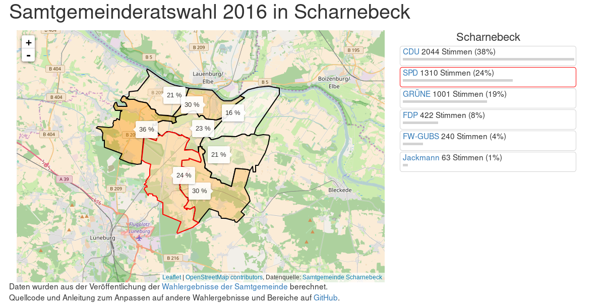

# kandidaten-ms

## Über
Karte mit den Kandidaten für die Kommunalwahl in Münster 2014. 

Erstellt mit Leaflet und Daten der Bewerber aus dem [Amtsblatt](http://www.muenster.de/stadt/amtsblatt/pdf/140425_Amtsblatt_8.pdf), Wahlbezirke aus [Daten der Stadt Münster](http://www.muenster.de/stadt/stadtplanung/pdf/a3_kommunalwahlbezirk.pdf). Aufbereitet und erstellt von Code for Muenster, siehe auch unser [Open data Repository](https://github.com/codeformuenster/open-data).

## Demo

